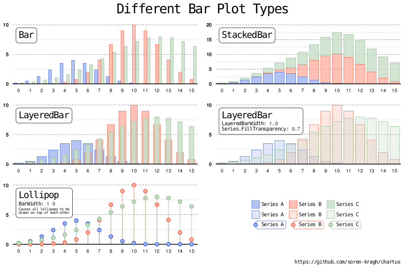
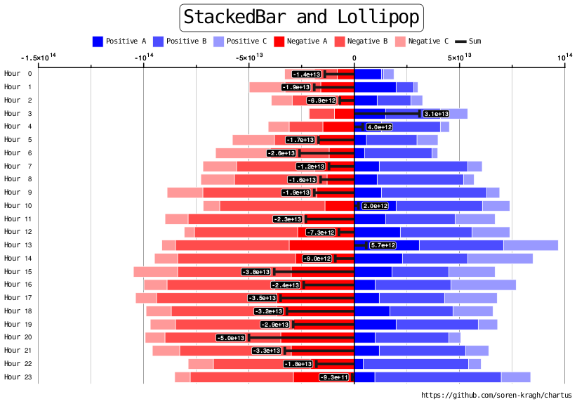
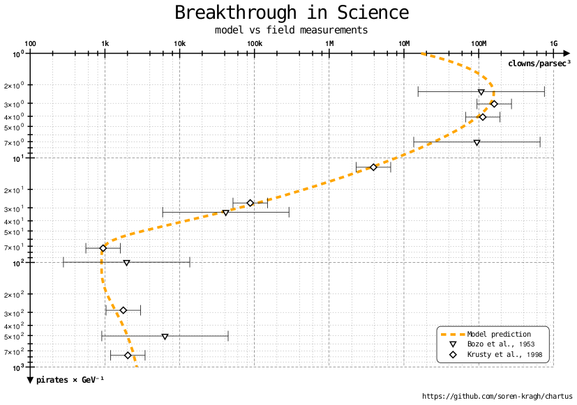

<div align="center">
  
</div>

Chartus is a simple Linux command line tool to generate basic charts in SVG or
HTML format.

- Super simple input format makes it easy to quickly visualize data.
- Ideally suited for a fully automated work flow using scripts etc.
- Works well for large data sets.
- Tweaking options are provided, but the automatic defaults should normally be fine.

The generated SVG files are compatible with a wide variety of software. You may
however also use the `svg2png` script (relies on `rsvg-convert`) to convert to
bitmap, which is often preferred for e-mails, messages, or if the data set, and
hence the SVG, is very large.

See [examples](#built-in-examples) below.

## Build

```sh
git clone --recurse-submodules https://github.com/soren-kragh/chartus.git
cd chartus
git checkout VERSION    # Replace VERSION with actual release tag, e.g. v1.0.0
git submodule update --init --recursive
make
```

## Install

```sh
sudo make install
```

Alternatively you can install for your user only:

```sh
make install PREFIX=$HOME/.local
```

In this case remember to add `$HOME/.local/bin` to your `PATH` variable if it is not
already there.

### Installed Commands

- `chartus` — The main charting tool
- `svg2png` — Converts SVG output to PNG (uses `rsvg-convert`)

### Self-Documenting

```sh
chartus -h
svg2png -h
```
See full [User Guide](#user-guide) (based on `chartus -T`).

## Uninstall

```sh
sudo make uninstall
```

# Built-In Examples

The built-in examples are generated with `chartus -eN` where `N` is a number
from 1 to 9. Use the simple template (`chartus -t`) as a starting point, then
study the inspirational examples for more fancy layout and styling, if needed.

## Example 1

`chartus -e1 | chartus | svg2png 0.75 >e1.png`

<div align="center">
  
</div>

## Example 2

`chartus -e2 | chartus | svg2png 0.75 >e2.png`

<div align="center">
  
</div>

## Example 3

`chartus -e3 | chartus | svg2png 0.75 >e3.png`

<div align="center">
  
</div>

## Example 4

`chartus -e4 | chartus | svg2png 0.75 >e4.png`

<div align="center">
  
</div>

## Example 5

`chartus -e5 | chartus | svg2png 0.75 >e5.png`

<div align="center">
  
</div>

## Example 6

`chartus -e6 | chartus | svg2png 0.75 >e6.png`

<div align="center">
  
</div>

## Example 7

`chartus -e7 | chartus | svg2png 0.75 >e7.png`

<div align="center">
  
</div>

## Example 8

`chartus -e8 | chartus | svg2png 0.75 >e8.png`

<div align="center">
  
</div>

## Example 9

`chartus -e9 | chartus | svg2png 0.75 >e9.png`

<div align="center">
  
</div>

# User Guide

TBD
