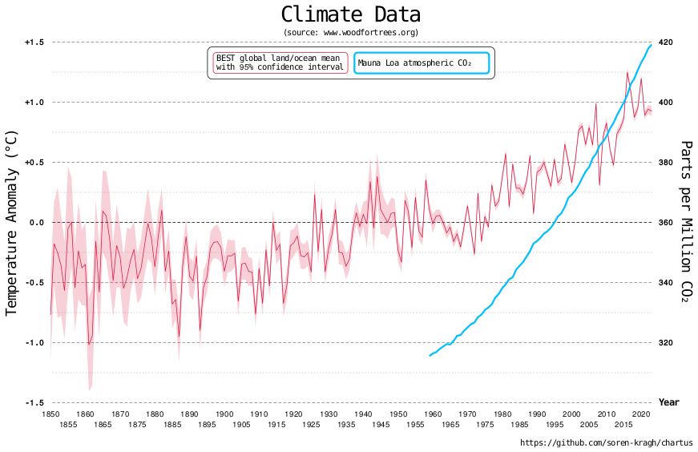
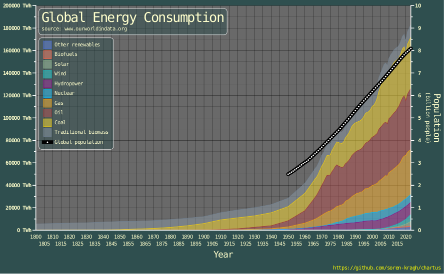

<div align="center">
  
</div>

Chartus is a simple Linux command line tool to generate basic charts in SVG or
HTML format.

- Very [simple input format](#shortlist-of-all-specifiers) makes it easy to
  quickly visualize data.
  - In the simplest case just pipe numbers to Chartus.
- Ideally suited for a fully automated work flow using scripts etc.
- Works well for [large data sets](#large-data-sets).
- Tweaking options are provided, but the automatic defaults are often fine.
- Support for custom annotations so you don't have to edit the image afterwards
  to add extra texts etc.

The generated SVG files are compatible with a wide variety of software, however,
more often than not you should use the `svg2png` script to convert to bitmap,
which is often preferred for e-mails, messages, or if the SVG gets very large.

See [examples](#built-in-examples) below.

# Build

```sh
git clone --recurse-submodules https://github.com/soren-kragh/chartus.git
cd chartus
git checkout VERSION    # Replace VERSION with actual release tag, e.g. v1.0.0
git submodule update --init --recursive
make
```

## Install or Update

```sh
sudo make install
```

Alternatively you can install only for your user:

```sh
make install PREFIX=$HOME/.local
```

In this case remember to add `$HOME/.local/bin` to your `PATH` variable if it is not
already there.

### Installed Commands

- `chartus` — The main charting tool
- `svg2png` — Converts SVG output to PNG (uses `rsvg-convert`)

**_NOTE:_** `rsvg-convert` must be installed for `svg2png` to work.

### Self-Documenting

```sh
chartus -h
svg2png -h
```

See full [Documentation](#documentation) (based on `chartus -t` and `chartus -T`).

## Uninstall

```sh
sudo make uninstall
make uninstall PREFIX=$HOME/.local
```

# Built-In Examples

The built-in examples are generated with `chartus -eN` where `N` is a number
from 1 to 10. Use the simple template (`chartus -t`) as a starting point, then
study the inspirational examples for more fancy layout and styling, if needed.

## Example 1

`chartus -e1 | chartus | svg2png >e1.png`

<div align="center">
  
</div>

## Example 2

`chartus -e2 | chartus | svg2png >e2.png`

<div align="center">
  
</div>

## Example 3

`chartus -e3 | chartus | svg2png >e3.png`

<div align="center">
  
</div>

## Example 4

`chartus -e4 | chartus | svg2png >e4.png`

<div align="center">
  
</div>

## Example 5

`chartus -e5 | chartus | svg2png >e5.png`

<div align="center">
  
</div>

## Example 6

`chartus -e6 | chartus | svg2png >e6.png`

<div align="center">
  
</div>

## Example 7

`chartus -e7 | chartus | svg2png >e7.png`

<div align="center">
  
</div>

## Example 8

`chartus -e8 | chartus | svg2png >e8.png`

<div align="center">
  
</div>

## Example 9

`chartus -e9 | chartus | svg2png >e9.png`

<div align="center">
  
</div>

## Example 10

`chartus -e10 | chartus | svg2png >e10.png`

<div align="center">
  
</div>

# Documentation

## Shortlist of All Specifiers

`chartus -t`

```

# Simple template

ChartBox: Off

Title       : Chart Title
Axis.X.Label: X-Axis Label
Axis.Y.Label: Y-Axis Label

Series.Type : XY
Series.New  : Series A
Series.New  : Series B
Series.Data :
        0       23.7    -15
        7.0     2.3     27
        40      20      -12
        47      10.0    5
        71      4.3     1
        97      14      -17

# Summary of all available specifiers (see -T template for details).
# Note: Axis.* is used here as documentation shorthand - specify each axis
# individually (Axis.X, Axis.Y, Axis.Y2, etc.)
#
# TitleHTML: Chartus
# Margin: 5
# BorderWidth: 5 25
# BorderColor: navy
# Padding: 10
# ForegroundColor: skyblue
# BackgroundColor: darkslategray
# GlobalTitle: Global Title
# GlobalSubTitle: Smaller Global Title
# GlobalSubSubTitle: Even Smaller Global Title
# GlobalTitlePos: Left
# GlobalTitleSize: 1.0
# GlobalTitleLine: On
# GlobalLegendHeading: Metals
# GlobalLegendBox: On
# GlobalLegendPos: Bottom
# GlobalLegendSize: 1.0
# GlobalLegendColor: lavender
# Footnote:
# FootnotePos: Center
# FootnoteLine: On
# FootnoteSize: 1.0
# LetterSpacing: 1.8 1.1 0.8
# ZeroToO: Off
# GridPadding: 0 12
# NewChartInGrid: 0 0 3 0 Center Bottom
# NewChartInChart: 0 0 Bottom Right
# ChartPadding: -1 0
# ChartArea: 1000 600
# ChartBox: On
# ChartAreaColor: dimgray
# AxisColor: white
# GridColor: green
# TextColor: lightyellow
# BoxColor: aqua 0 0.5
# Title:
# SubTitle:
# SubSubTitle:
# TitleBox: On
# TitlePos: Left
# TitleInside: On
# TitleSize: 1.0
# Axis.X.Orientation: Vertical
# Axis.*.Reverse: Off
# Axis.*.Style: Auto
# Axis.*.Label:
# Axis.*.SubLabel:
# Axis.*.LabelSize: 1.0
# Axis.*.Unit:
# Axis.*.UnitPos: Above
# Axis.*.LogScale: On
# Axis.*.Range: 0 100 90
# Axis.*.Pos: Top
# Axis.*.Tick: 10.0 4
# Axis.*.TickSpacing: 0 5
# Axis.*.Grid: Off On
# Axis.*.GridStyle: Auto
# Axis.*.GridColor: blue
# Axis.*.NumberFormat: Magnitude
# Axis.*.NumberSign: On
# Axis.*.NumberUnit: s
# Axis.*.MinorNumber: On
# Axis.*.NumberPos: Auto
# Axis.*.NumberSize: 1.0
# LegendHeading: Countries
# LegendBox: On
# LegendPos: Below
# LegendSize: 1.0
# BarWidth: 0.8 0.7
# LayeredBarWidth: 1.0
# BarMargin: 0
# Series.Type: XY
# Series.New: Name of series
# Series.Staircase: On
# Series.Snap: Off
# Series.Prune: 0.5
# Series.GlobalLegend: On
# Series.LegendOutline: Off
# Series.Axis: Y2
# Series.Base: 0
# Series.Style: 32
# Series.MarkerShape: Circle
# Series.MarkerSize: 8
# Series.LineWidth: 1
# Series.LineDash: 3 1
# Series.Lighten: -0.3
# Series.FillTransparency: 0.8
# Series.Color: indigo
# Series.LineColor: black
# Series.FillColor: None
# Series.Tag: On
# Series.TagPos: Below
# Series.TagSize: 0.8
# Series.TagBox: On
# Series.TagTextColor: black
# Series.TagFillColor: lightyellow 0 0.3
# Series.TagLineColor: black
# Series.Data:
# MacroDef: MyMacro
# MacroEnd: MyMacro
# Macro: MyMacro
#
# @PointCoor: Off
# @Axis: Y1
# @Layer: Top
# @LineWidth: Width
# @LineDash: Dash [Hole]
# @LineColor: black
# @FillColor: None
# @TextColor: black
# @TextAnchor: Top Center
# @TextSize: 24
# @TextBold: On
# @LetterSpacing: 1.8 1.1 0.8
# @RectCornerRadius: 10
# @Line: X1 Y1 X2 Y2
# @Rect: X1 Y1 X2 Y2
# @Circle: X Y Radius
# @Ellipse: X Y RadiusX RadiusY
# @Polyline: X1 Y1 X2 Y2 X3 Y3 ...
# @Polygon: X1 Y1 X2 Y2 X3 Y3 ...
# @TextArrow: DX DY [HeadGap [TailGap]]
# @Text: X Y
# @TextBox: X Y
# @Arrow: X1 Y1 X2 Y2 [HeadGap [TailGap]]
# @ArrowWidth: 0
# @Context: {
# @Context: }
```

## Full Documentation

`chartus -T`

```

# This file documents the input format for the Chartus program. This file is not
# intended to be used directly; use the simple template (chartus -t) as a
# starting point and pick relevant specifies from this file as needed. It is
# recommended to let Chartus determine things automatically when possible.
#
# The UTF-8 character encoding standard is used.
#
# The input file consists of a number of specifiers. Any line starting with a
# '#' at column 0 is ignored, empty lines are also ignored. The simplest input
# file consists only of data values, the Series.Data key is implicit in this
# special case.
#
# A specifier takes the form:
# KEY: VALUE(s)
# or
# KEY:
#   VALUE(s)
#   VALUE(s)
#   ...
#
# The KEY must be unindented and any VALUE(s) on the following lines must be
# indented, preferably by the same amount (important for text VALUEs). Multiple
# VALUEs on the same line must be whitespace separated.
#
# Text VALUEs such as titles and labels may span multiple lines, in which case
# they should be uniformly indented. Please observe the LetterSpacing specifier
# in case wide CJK characters (Chinese, Japanese, Korean) are used.
#
# The nature of the X-axis affects many of the properties of the chart. The
# X-axis can either be numerical or textual. A numerical X-axis has real number
# values just like the Y-axis and is thus more mathematical in nature. On the
# other hand, a textual X-axis has text strings as "values". If just one series
# is defined which uses textual X-values (e.g. a Bar plot), then the X-axis as a
# whole becomes textual. See Series.Type for more information.
#
# A color can be any of the 147 named SVG colors (google "svg colors") or a
# hexadecimal RGB value of the form #rrggbb; None means no color. The optional
# 2nd value (-1.0 to 1.0) specifies by how much to lighten the color (or darken
# if negative). The third optional value specifies the transparency of the color
# (0.0 to 1.0).
#
# Defining one or more charts generally follows this sequence:
#
#   NewChartInGrid: <grid position of first chart>
#   Series.Type: <type of all following series>
#   Series.New: <first series>
#   <specifiers for above series>
#   ...
#   Series.New: <next series>
#   <specifiers for above series>
#   ...
#   Series.Data:
#   <data for all above series>
#
#   NewChartInGrid: <grid position of next chart>
#   ...
#
# You don't need NewChartInGrid if you just have one chart (the common case).
#
# Note that many specifiers are persistent, meaning that they will carry over
# into the next series; use Series.Style to reset (almost) all persistent style
# specifiers.
#
# In the following, all supported specifiers will be documented with examples.
# Everything has been commented out in this file, so it will not do anything if
# used directly as input to Chartus. Please refer to the built-in inspirational
# examples (chartus -eN) for actual working input files.
#

# The HTML tab title to show in the HTML browser. Cannot be multi-line.
#TitleHTML: Chartus

# Margin in points; default is 0.
#Margin: 0

# Border in points optionally followed by border corner radius; default is no
# border (0) and radius 12.
#BorderWidth: 5 12
#BorderColor: maroon

# Padding around everything in points; default is 8.
#Padding: 8

# The foreground color is primarily used as the default color for texts. The
# background color also determines the chart area color, unless the chart area
# color is also given (see ChartAreaColor).
#ForegroundColor: brown
#BackgroundColor: darkslategray

# See Title, which is normally what should be used for single charts. Global
# titles are placed at the top and are typically used for when multiple charts
# are organized in a grid (see NewChartInGrid).
#GlobalTitle: Title
#GlobalSubTitle: Smaller Title
#GlobalSubSubTitle: Even Smaller Title
#GlobalTitlePos: Left
#GlobalTitleSize: 1.0
#GlobalTitleLine: On

# An optional heading for the global legends (see Series.GlobalLegend).
#GlobalLegendHeading: Metals

# Draw global legends in a box; may be On or Off; default is Auto.
#GlobalLegendBox: On

# Specify the position of global series legends. If Auto (the default), the
# global legends will be placed in a free chart grid location if possible, or
# otherwise below all the charts. Alternatively a grid location (with optional
# alignment) can be specified explicitly, using the same syntax as is used for
# the NewChartInGrid specifier.
#GlobalLegendPos: Bottom

# Set the relative size of global legend box texts.
#GlobalLegendSize: 1.0

# The background color of the global legend box.
#GlobalLegendColor: darkseagreen

# Adds a footnote. Footnotes are placed below everything. Multiple footnotes
# are supported, possibly with different alignment (see FootnotePos).
Footnote:
  https://github.com/soren-kragh/chartus

# May be Left, Right, or Center; default is Left. Applies to the most recently
# added footnote and any additional footnotes that may follow.
FootnotePos: Right

# Enables a line above the footnotes.
#FootnoteLine: On

# Set the relative size of footnote texts.
#FootnoteSize: 1.0

# The default spacing and positioning of letters are based on mono-spaced Latin
# letters. This is done in order to get a fully portable SVG where things do not
# become misaligned if font properties differ slightly on a different system.
# If non-Latin letters are used, however, the LetterSpacing may be used to
# adjust the spacing by the given factor. The first number is the width
# adjustment factor, the second optional number is the height adjustment factor,
# and the third optional number is the baseline adjustment factor.
#LetterSpacing: 1.8 1.1 0.8

# Chartus uses monospace font in order to make the SVG as platform independent
# as possible, this often results in slashed zeros which does not look so good.
# ZeroToO allows you to replace digit '0' with the letter capital 'O'; may be On
# or Off. Default is On.
#ZeroToO: On

# Padding (in points) around individual charts in the grid; default is 12. This
# setting only has any effect when having multiple charts. A negative value
# means that only the core chart areas are considered when placing the charts in
# a grid. An optional second number specify the minimal padding around the core
# chart areas.
#GridPadding: 12

# Start creation of of new chart; not needed if you only have one chart. When
# having multiple charts, these are organized in a grid as specified. The first
# two numbers specify the row and column of the upper left corner, and the
# second optional two numbers specify the row and column of the lower right
# corner; the new chart may span multiple grid cells in either direction. If no
# grid location is given, the new chart is just added below any existing charts
# in the grid. After the optional grid location follows the optional
# horizontal/vertical alignment within the allocated grid cell(s); the default
# alignment will push charts located at a grid edge towards that edge.
#
# The chart edges of the same row/column will be aligned if possible, empty
# rows/columns can however be inserted to avoid this, for example:
#
# NewChartInGrid: 0 0
# ChartArea: 200 200
# NewChartInGrid: 0 1
# ChartArea: 200 200
# NewChartInGrid: 1 0 1 1
# ChartArea: 600 200
#
# Will give:
# +----+      +----+
# |    |      |    |
# |    |      |    |
# +----+      +----+
# +----------------+
# |                |
# |                |
# +----------------+
#
# Whereas:
#
# NewChartInGrid: 0 1
# ChartArea: 200 200
# NewChartInGrid: 0 2
# ChartArea: 200 200
# NewChartInGrid: 1 0 1 3
# ChartArea: 600 200
#
# Will give:
#   +----+  +----+
#   |    |  |    |
#   |    |  |    |
#   +----+  +----+
# +----------------+
# |                |
# |                |
# +----------------+
#
# When using NewChartInGrid, most state is reset as if a new blank file is
# started; use macros to easily repeat specifiers shared among multiple charts
# in the grid.
#NewChartInGrid: 0 0 1 1 Right Top

# NewChartInChart has the same syntax as NewChartInGrid but with grid collision
# check disabled. A typical (if not only) use case for this is to embed a
# smaller chart within and on top of another chart. When starting a new chart
# with NewChartInChart, the ChartPadding (see below) defaults to 12 0. Please
# note that the new chart is just placed on top of whatever previous charts were
# drawn before, so more manual adjustments than usual might be needed.
#NewChartInChart: 0 0 Left Top

# Defines the padding for the current chart, it works somewhat like GridPadding
# but applies to the current chart only. Normally charts arranged in a grid are
# aligned based on their core chart areas as that usually looks better; with
# ChartPadding you can adjust that behavior. The first number specifies that the
# alignment shall be relative to all chart elements instead of just the core
# chart area, the given number is the additional extra margin. If the first
# number is negative the core chart area is used for alignment (default
# behavior). The second optional number specifies the additional extra margin
# when aligning relative the core chart area.
# You typically use ChartPadding to adjust placement of embedded charts (see
# NewChartInChart).
# The NewChartInGrid and NewChartInChart defaults respectively are shown below.
#ChartPadding: -1 0
#ChartPadding: 12 0

# Add a frame around the chart. First number is the frame width; second optional
# number is the inside padding; third optional number is the corner radius of
# the frame. When organizing framed charts in a grid you probably want to align
# relative to the frames rather than the core chart areas, use ChartPadding
# for this (e.g. ChartPadding: 0).
# Trick: You can also use an invisible annotation to manually control where the
# frame is drawn relative to the core chart area.
#ChartFrame: 5 8 0

# Specifies the color of the chart frame and the color of the canvas within the
# frame.
#ChartFrameColor: red
#ChartCanvasColor: white

# Specifies the dimensions of the core chart area where the data is graphed.
# The values are in points and should typically be around 1000. Since SVG is
# scalable these dimensions primarily determine the relative size of text
# annotations and line thicknesses; texts will appear relatively larger if the
# core chart area is small and vice versa.
#ChartArea: 1000 600

# Draw a box around chart area; may be On or Off.
#ChartBox: On

# Change color of various chart elements.
#ChartAreaColor: dimgray
#AxisColor: white
#GridColor: green
#TextColor: lightyellow

# The background color of legend box and title box (when these are shown).
#BoxColor: aqua 0 0.5

# Titles are normally placed at the top of the chart.
Title: This is the title of the chart

SubTitle:
  An additional smaller title

SubSubTitle:
  An extra even smaller title

# Normally it is determined automatically whether titles should be drawn in a
# box; specifying TitleBox forces the box to be drawn or not; may be On or Off.
#TitleBox: On

# May be Left, Right, or Center; default is Center. The optional second argument
# may be Top or Bottom and sets the vertical alignment when inside the chart
# area (TitleInside: On); default is Top.
#TitlePos: Center Top

# Specifies if the title(s) should be placed inside the chart area; may be On or
# Off (default). Caution is advised when doing this as it may block out other
# chart elements, but for relatively small titles it can make sense. Specifying
# a semi-transparent BoxColor can also help in this case.
#TitleInside: On

# Set the relative size of titles.
#TitleSize: 1.0

# In the following Axis.Y, Axis.Y1, and Axis.PriY refers to the primary Y-axis.
# A secondary Y-axis is also possible and is identified as Axis.Y2 or Axis.SecY.
# All specifies for the primary Y-axis also apply to the secondary Y-axis.

# The orientation of the X-axis may be Horizontal or Vertical, the Y-axis
# orientation cannot be specified directly as it is always orthogonal to the
# X-axis.
#Axis.X.Orientation: Horizontal

# Reverse axis direction; may be On or Off.
#Axis.X.Reverse: On
#Axis.Y.Reverse: On

# May be Auto, None, Line, Arrow, or Edge.
#Axis.X.Style: Auto
#Axis.Y.Style: Auto

#Axis.X.Label: X-Axis
#Axis.Y.Label: Y-Axis
#Axis.SecY.Label: Secondary Y-Axis

#Axis.X.SubLabel: smaller label
#Axis.Y.SubLabel: smaller label

# Set the relative size of axis labels.
#Axis.X.LabelSize: 1.0
#Axis.Y.LabelSize: 1.0

# Especially for linear scale, it is often a good idea to select units and scale
# the data accordingly to avoid very small or very large numbers in the graph.
# It is unwise to not have units on your axes, but the Axis.*.Label or
# Axis.*.NumberUnit can also serve that purpose.
#Axis.X.Unit: Mb/s
#Axis.Y.Unit:
#  micro
#  seconds

# Position of unit text; may be Auto, Left, Right, Top/Above, or
# Bottom/Below. Not all may apply; default is Auto (recommended).
#Axis.X.UnitPos: Auto
#Axis.Y.UnitPos: Auto

# Select logarithmic scale; may be On or Off.
#Axis.X.LogScale: On
#Axis.Y1.LogScale: On
#Axis.Y2.LogScale: On

# Min, max, and optionally where the other orthogonal axis crosses this axis.
# Auto ranging is applied if no Range specifier is given (recommended). If the
# Axis Style is Edge, then the orthogonal axis crossing determines at which edge
# the axis is placed. If both a primary and a secondary Y-axis is used, then the
# primary Y-axis is always to the left/bottom, and the secondary Y-axis is
# always to the right/top. The X-axis range is ignored if the chart has textual
# X-values.
#Axis.X.Range: 0 100 90
#Axis.Y.Range: -5 25

# Position of axis; default is Auto. Overrides any orthogonal axis cross defined
# by the Range specifier. If both a primary and a secondary Y-axis is used, then
# the primary Y-axis is always to the left/bottom, and the secondary Y-axis is
# always to the right/top. For the X-axis, the special positions BasePri/BaseY1
# and BaseSec/BaseY2 may be used to indicate the Bar/Area base (usually zero,
# see Series.Base).
#Axis.X.Pos: Top
#Axis.Y.Pos: Right

# Define axis ticks.
# Linear scale:
#   First number is the major tick interval and the second number is an integer
#   specifying the number of minor sub-intervals per major tick (ignored for
#   textual X-axis).
# Logarithmic scale:
#   First number is the base, normally 10, and second is an integer specifying
#   the number of minor sub-intervals per division, also usually 10. The base
#   can only be a power of 10, while the minor sub-intervals can only be
#   factors of 100.
# Tick intervals are determined automatically if no Tick specifier is given
# (recommended).
#Axis.X.Tick: 10.0 4
#Axis.Y.Tick: 1.0 0

# When the X-axis is textual, often it will not be possible to show the text for
# all data points. An attempt will be made to fit the text, but at some point
# texts will have to be dropped. The TickSpacing allows user-control over what
# is shown, for example, if the texts represent years, showing only every 10th
# year can be appealing. The first number is the starting position to show, and
# the second optional number is the stride after that (default stride is 1).
# When stacking charts (see NewChartInGrid) sharing the same textual X-axis, a
# trick to not show the categories for the stacked charts, is to set the
# TickSpacing start position really high for all but the bottom chart.
#Axis.X.TickSpacing: 0 10

# Turn grid lines on/off for major and minor ticks; may be On or Off. Unless
# explicitly enabled for both Y-axes, only the grid for one of the Y-axes will
# be shown, typically the primary Y-axis. Enabling the grid for both Y-axes is
# probably a bad idea in most cases; a better approach is to adjust the Range
# for the two Y-axes such the the primary grid aligns with the secondary Y-axis.
# The minor grid is always off for textual X-axis.
#Axis.X.Grid: On On
#Axis.Y.Grid: On Off

# Grid style may be Auto, Dash, or Solid; default is Auto.
#Axis.X.GridStyle: Auto
#Axis.Y.GridStyle: Auto

# Color of the grid.
#Axis.X.GridColor: blue
#Axis.Y.GridColor: blue

# Number format may be None, Fixed, Scientific, or Magnitude. Default is Fixed
# for linear scale and Magnitude for logarithmic scale. Magnitude means showing
# e.g. "10k" instead of "10000" etc.
#Axis.X.NumberFormat: Fixed
#Axis.Y.NumberFormat: Fixed
#Axis.Y2.NumberFormat: Magnitude

# Forces the sign to be shown also for positive numbers; may be On or Off.
#Axis.X.NumberSign: On
#Axis.Y.NumberSign: On

# A number unit is a short unit indication placed after each axis number. This
# can be an alternative to the Unit specifier above. Leading _ is replaced by
# space.
#Axis.X.NumberUnit: s
#Axis.Y.NumberUnit: _Volts
#Axis.Y2.NumberUnit: Ω

# Specify if numbers are shown for minor ticks, default for linear scale is
# Off, while default for logarithmic scale is On; may be On or Off.
#Axis.X.MinorNumber: On
#Axis.Y.MinorNumber: Off

# Position of axis numbers; may be Auto, Left, Right, Top/Above, or
# Bottom/Below. Not all may apply; default is Auto (recommended). Very large or
# very small numbers will be hard to read, so it is a very good idea to scale
# the data and use suitable units.
#Axis.X.NumberPos: Auto
#Axis.Y.NumberPos: Auto

# Set the relative size of axis numbers and axis unit.
#Axis.X.NumberSize: 1.0
#Axis.Y.NumberSize: 1.0

# An optional legend heading.
#LegendHeading: Types of Food

# Normally it is determined automatically whether legends should be drawn in a
# box; specifying LegendBox forces the box to be drawn or not; may be On or Off.
#LegendBox: On

# Legend position may be Auto, Left, Right, Top, or Bottom. Legends for the
# series are normally (Auto) placed somewhere inside the core chart area, but if
# this gets too cluttered you may place the series legends outside the core
# chart area; this is achieved by supplying one single position. If two
# positions are given, the legends are however still placed inside the core
# chart area but constrained to the given position. In this case an optional
# additional number may be given constraining the number of legends per row to
# that number. Note that the position may be ignored if it cannot be realized.
# Place below core chart area:
#LegendPos: Bottom
# Constrain to the right side inside the core chart area:
#LegendPos: Right Auto
# Constrain to two legends per row, but otherwise place automatically somewhere
# inside the core chart area:
#LegendPos: Auto Auto 2

# Set the relative size of legend box texts.
#LegendSize: 1.0

# Specify the relative width of bars (0.0 to 1.0). The optional second value
# (0.0 to 1.0) determines the total relative width allocated to all bars at the
# same X-value before individual widths are applied.
# For Lollipop plot, a zero for the second value can make sense, as it will
# cause all lollipops to be shown on top of each other.
# Defaults shown below.
#BarWidth: 1.0 0.85

# Defines the relative width (0.0 to 1.0) of the topmost layered bar (default is
# 0.5); applies to LayeredBar plots only. LayeredBarWidth makes the layered bars
# progressively narrower thereby making the underlying bars partially visible.
# Another strategy is to set LayeredBarWidth to 1.0 and instead make the bars
# semi transparent (see Series.FillTransparency), or a combination of
# LayeredBarWidth and transparency.
#LayeredBarWidth: 0.5

# The bar margin specifies the extra margin for the X-axis of bar graphs, and
# all textual X-axis graphs such as Line or Area. For example, if a bar graph
# has three bars and BarMargin is 1.0, then the X-axis will be laid out as if it
# has five buckets (1.0+3+1.0). The effect is that extra margin is created at
# the start/end of the bar graph (or any textual X-axis graph).
#BarMargin: 0

# Series type may be:
#   Type        X-value     Description
#-------------------------------------------------------------------------------
#   XY          Number      X/Y plot (default). Regard X-values as numbers and
#                           draw lines between data points, possibly with point
#                           markers. Recommended for very large data sets (do
#                           not enable point markers in this case though).
#   Scatter     Number      Scatter plot. Same as XY but with no lines and
#                           always with point markers. Using a highly
#                           transparent LineColor and/or FillColor can achieve a
#                           density effect.
#   Line        Text        Line plot. Regard X-values as text and draw lines
#                           between data points, possibly with point markers.
#                           Recommended for very large data sets (do not enable
#                           point markers in this case though).
#   Point       Text        Like Scatter, but regard X-values as text.
#   Lollipop    Text        Lollipop plot. Regard X-values as text and draw
#                           lines from data points to Base; default with point
#                           markers. Do not use for large data sets.
#   Bar         Text        Bar plot. Regard X-values as text and draw bars
#                           from data points to Base (usually zero). Do not use
#                           for large data sets.
#   StackedBar  Text        Like Bar, but stack on top of (or below if negative
#                           relative to Base) the previous bar. Do not use for
#                           large data sets.
#   LayeredBar  Text        Like Bar, but place bars from different series on
#                           top of each other in layers; see LayeredBarWidth.
#                           Do not use for large data sets.
#   Area        Text        Area plot. Regard X-values as text and draw an area
#                           polygon between data points and the Base line.
#                           Optionally also draw a line between data points,
#                           possibly with point markers.
#   StackedArea Text        Like Area, but stack on top of (or below if negative
#                           relative to Base) the previous StackedArea. Note
#                           that negative values (relative to Base) are stacked
#                           separately, so mixing negative with positive in the
#                           same series will likely look mangled.
#-------------------------------------------------------------------------------
#
# Since the X-values are true numbers for XY and Scatter types, these types
# should normally not (*) be shown on the same chart as any other types, where
# the X-value is interpreted as a text string. The Series.Type attribute applies
# to all subsequent series, or until it is redefined.
#
# (*) If you do mix (using a separate Series.Data), the underlying X-value on a
# textual X-axis is just the position starting from 0, so for a Bar plot with 10
# bars the X-values will go from 0 to 9. This knowledge can be used to show XY
# or Scatter plots on top of e.g. Bar plots, but often Line or Point plots will
# be a better choice in this situation.
#
# The Series-Type specifier must be given BEFORE the Series.New to which it
# associate.
#Series.Type: XY

# Each new series must start with this specifier giving the name of the
# series (may be multi-line); the type of the newly created series will be
# defined by the previously given Series.Type.
#Series.New: Name of series

# The following Series specifiers associate to the above newly created series.

# Staircase modifier for Line plot; may be On or Off.
#Series.Staircase: Off

# Defines if snapping to data points is enabled in HTML; may be On or Off,
# default is On. This attribute applies to the current series and all subsequent
# series, or until it is redefined.
#Series.Snap: On

# Set the prune distance in points. For very large data sets, graphical details
# are removed if it is judged that they do not contribute significantly to the
# final render. While Chartus itself can handle large data sets, the subsequent
# rendering of the SVG by 3rd party tools may struggle or even crash if the SVG
# gets too big. The default is 0.3, meaning that if the pruning causes a render
# inaccuracy of less than 0.3 points (pixels), pruning can happen. This
# attribute applies to the current series and all subsequent series, or until it
# is redefined. Bar, StackedBar, LayeredBar, and Lollipop plots cannot be
# pruned, but you should not use these types for large data sets anyway. The
# pruning algorithm is NOT a smoothing operation. Thin spikes are preserved and
# the overall shape of the series is generally preserved, while at the same time
# drastically reducing the number of SVG elements in e.g. noisy sensor data etc.
#Series.Prune: 0.3

# Set the series legend to be global; may be On or Off, default is Off. Global
# legends are relevant when multiple charts are organized in a grid, in which
# case the legends can instead be shown outside the charts by marking them
# global. Global legends may be shared, i.e. shown only once despite several
# series having that legend. For sharing to occur, the name and style of the
# series must be the same. This attribute applies to the current series and all
# subsequent series, or until it is redefined.
#Series.GlobalLegend: Off

# Specify if line style legends are shown with an outline around the legend text
# (On), or with a small line segment in front of the legend text (Off); default
# is On. Note that the outline may be suppressed irrespective of this setting.
# This attribute applies to the current series and all subsequent series, or
# until it is redefined.
#Series.LegendOutline: Off

# The Y-axis to use for the data values, may be Primary/Y1 or Secondary/Y2; the
# default is Primary. This attribute applies to the current series and all
# subsequent series, or until it is redefined.
#Series.Axis: Primary

# Select the base for bar and area type plots; default is 0. This attribute
# applies to the current series and all subsequent series, or until it is
# redefined.
#Series.Base: 0

# The style of the graph. The style is a number in the range from 0 to 79; if no
# Style specifier is given, it is assigned an incrementing number based on the
# last given Series.Style.
#  0 to  9: Solid line using 10 different colors
# 10 to 19: Same as 0 to 9 but with short dashed line
# 20 to 29: Same as 0 to 9 but with medium dashed line
# 30 to 39: Same as 0 to 9 but with long dashed line
# 40 to 79: Same as 0 to 39, but with thinner line
# Note that the 10 default colors have been chosen to be easier to discern for
# people with the most common form of color blindness (red-green).
# Specifying a Series.Style clears any persistent style modifiers except
# Series.MarkerShape and Series.Lighten.
#Series.Style: 4

# The point marker shape may be Circle, Square, Triangle, InvTriangle, Diamond,
# Cross, Star, LineX, or LineY; default is Circle. LineX/LineY is a small line
# parallel with the X- or Y-axis. This persistent attribute applies to the
# current series and all subsequent series, or until it is redefined.
#Series.MarkerShape: Circle

# Diameter of the point markers. This persistent attribute applies to the
# current series and all subsequent series, or until it is redefined.
#Series.MarkerSize: 0

# This specifies the line width; it acts as a persistent modifier to the current
# Style. This attribute applies to the current series and all subsequent series,
# or until it is redefined.
#Series.LineWidth: 1

# This specifies the line dash; it acts as a persistent modifier to the current
# Style. The first number is the length of the dash and the second optional
# number of the length of the hole. This attribute applies to the current series
# and all subsequent series, or until it is redefined.
#Series.LineDash: 3 1

# This value (-1.0 to 1.0) specifies by how much the series colors should
# lightened (or darkened if negative); it acts as a persistent additive modifier
# to the current Style. This attribute applies to the current series and all
# subsequent series, or until it is redefined.
#Series.Lighten: 0

# This value (0.0 to 1.0) specifies the transparency to be used for Bar and Area
# fill color; it acts as a persistent override modifier to the current Style.
# This attribute applies to the current series and all subsequent series, or
# until it is redefined.
#Series.FillTransparency: 0

# This specifies the color; it acts as a one-time modifier to the current Style.
# The Color attribute applies to the current series only.
#Series.Color: lightsteelblue

# This specifies the line color; it acts as a one-time modifier to the current
# Style. The LineColor attribute applies to the current series only.
#Series.LineColor: darkorange -0.2 0.7

# This specifies the fill color used for bars, areas, marker interiors, etc.; it
# acts as a one-time modifier to the current Style. The FillColor attribute
# applies to the current series only.
#Series.FillColor: None

# Enable tagging of data points, that is, showing the data values near the data
# points. This will quickly become cluttered, so should only be used for
# relatively simple charts. For XY and Scatter plot, both the X- and the Y-value
# are shown.
#Series.Tag: On

# Position of tag; may be Auto, Left, Right, Above, Below, or Center. Default is
# Auto. For Bar and Lollipop type plots the position may be Auto, Center, Base,
# End, or Beyond.
#Series.TagPos: Below

# Tag size scaling factor.
#Series.TagSize: 0.8

# Show the tag in a small box; may be On or Off.
#Series.TagBox: On

# Tag text color, the fill color of the tag box (if any), and the color of the
# line around the tag box (if any); they act as persistent modifiers to the
# current Style. These attributes apply to the current series and all subsequent
# series, or until they are redefined.
#Series.TagTextColor: black
#Series.TagFillColor: lightyellow 0 0.3
#Series.TagLineColor: black

# The Series.Data defines the actual data values, each line is an X-value
# followed by one or more Y-values corresponding to each of the series defined
# above. If no new series was created beforehand, an anonymous one will be
# automatically created. If all series are either XY or Scatter, then the
# X-value will be interpeted as a number, otherwise the X-value is regarded as a
# text string, which must be double quoted if it contains spaces or commas.
# If a dash (-) is given for a value, it means that the data point is skipped,
# if an exclamation mark (!) is given for a value, it means that the data point
# is undefined. The exclamation mark causes a break in a line plot, while a dash
# does not. This feature can be used in case a series has incomplete or missing
# data compared to the other series.
Series.Data:
#       X-value         Series 1        Series 2
        8               22              5e1
        30              -               10e-1
        80              14              -17
        "Fruit Cake"    -42             88

# A macro is defined with MacroDef and must end with MacroEnd; the macro name
# must match. The macro is called with Macro. A macro can call other macros but
# cannot itself define a macro.
#MacroDef: MyMacro
#<lines in macro>
#MacroEnd: MyMacro
#Macro: MyMacro

#-------------------------------------------------------------------------------
# Annotations are user created graphical elements; an annotation specifier is
# indicated by @. Coordinates can be in chart coordinates or points (pixels) or
# a combination. Point (pixel) coordinates use standard coordinates with (0,0)
# in the lower left corner. Coordinate examples:
#
#       If @PointCoor Off, chart XY coordinate:             27.3 -44
#       If @PointCoor On, point (pixel) XY coordinate:      50 300
#       Chart XY coordinate with point displacement:        -12.2+10 45e2-8
#       Special X coordinates:                              Left Right Center
#       Special X coordinates (abbreviations):              L R C
#       Special Y coordinates:                              Bottom Top Center
#       Special Y coordinates (abbreviations):              B T C
#       Point XY coordinate relative to bottom left corner: L+100 B+50
#
# Coordinates with point displacement can for example be used to place text near
# to but displaced from interesting data points. The special coordinates Left,
# Right, Top, Bottom can be used to indicate the edges of the chart area.
# Non-XY-coordinates like Radius is always in points.
#
# Note that for annotations, the X- and Y-coordinates always follow the
# horizontal and vertical orientations respectively. This means that if the
# chart is rotated (see Axis.X.Orientation), then Y-axis chart-coordinates are
# used for annotation X-coordinates (horizontal) and vice versa.
#
# When an annotation coordinate refers to the Y-axis chart-coordinate and two
# Y-axes are defined, the @Axis specifier (see below) defines which one to use.
# However, you can always specify the Y-axis explicitly using the Y1: or Y2:
# prefix, for example:
#
#       Non rotated chart:      50 Y2:17.4
#       Rotated chart:          Y2:0.2 45
#
#-------------------------------------------------------------------------------

# Unused macro used to exclude the annotation examples, as they do not directly
# compile, like X1 instead of actual coordinate etc.
MacroDef: AnnotationDocumentation

# Selects if coordinates are in points (pixels) or in chart values; may be
# On or Off, default if Off. Applies to all subsequent annotations.
@PointCoor: Off

# Determines if default Y-axis chart-coordinates refer to the Y1- or Y2-axis;
# default is Y1. Applies to all subsequent annotations. Note that chart-
# coordinates can still be overridden with the Y1: or Y2: prefix, the @Axis just
# defines the default when no override is given. And again, note that for
# rotated charts that Y-axis chart-coordinates are used for annotation
# X-coordinates and vice versa.
@Axis: Y1

# May be Top or Bottom and determines if annotations are placed above or below
# the plots. Applies to all subsequent annotations.
@Layer: Top

# Width/Dash/Hole in points. Applies to all subsequent annotations.
@LineWidth: Width
@LineDash: Dash [Hole]

# See earlier description of color format. Applies to all subsequent
# annotations.
@LineColor: black
@FillColor: None
@TextColor: black

# Applies to all subsequent annotations.
@TextAnchor: Top Center
@TextSize: 24
@TextBold: On

# The LetterSpacing (see earler description) is used for all subsequent @Text
# and @TextBox elements.
@LetterSpacing: 1.8 1.1 0.8

# Rounded corners for rectangles; is used for all subsequent @Rect and @TextBox
# elements.
@RectCornerRadius: 10

@Line: X1 Y1 X2 Y2
@Rect: X1 Y1 X2 Y2
@Circle: X Y Radius
@Ellipse: X Y RadiusX RadiusY
@Polyline: X1 Y1 X2 Y2 X3 Y3 ...
@Polygon: X1 Y1 X2 Y2 X3 Y3 ...

# Enable an arrow pointer for all subsequent @Text and @TextBox elements. DX and
# DY are in points (pixels) and defines the length and direction of the arrow
# pointer; see @Arrow for descriptions of HeadGap and TailGap. The arrow is
# drawn from the current @TextAnchor. Note that the pointer direction may be
# changed depending on the current @TextAnchor. Disable arrow pointer by setting
# both DX and DY to zero.
@TextArrow: DX DY [HeadGap [TailGap]]

# The X,Y is relative to the current @TextAnchor or the current @TextArrow if
# enabled.
@Text: X Y
  Hello
  World

# Like @Text, but with a box.
@TextBox: X Y
  Hello
  World

# Draw an arrow. Often a data point coordinate is pointed out, but you would not
# want the arrow to obscure the data point. In this case use HeadGap to shorten
# the end of the arrow thereby crating a gap (in points) to the coordinate.
# TailGap works similarly for the start of the arrow.
@Arrow: X1 Y1 X2 Y2 [HeadGap [TailGap]]

# Normally arrows are drawn with the current line width and color. Setting the
# @ArrowWidth larger than zero causes arrows to be drawn as a polygon using the
# current line and fill attributes.
@ArrowWidth: 0

# Use these to create a local annotation context where you can change settings
# like colors etc. without affecting the parent context.
@Context: {
@Context: }

#-------------------------------------------------------------------------------
# Global annotations.
#
# The above annotation specifiers are tied to the current chart being defined.
# If several charts are organized in a grid, global annotations can be defined.
# Global annotation specifier keys start with @@ instead of @ but are otherwise
# the same as normal annotation specifier. There are some changes though for
# global annotation specifiers, which will be described next.
#
# Coordinates for global annotations are still relative to a chart, but you now
# have to specify which chart. All coordinates for global annotations must
# therefore be prefixed by N: where N is the chart number; charts are numbered
# in the order they are defined starting with 0.
#
#       Global coordinate example:      2:-17 2:Y2:23
#
#-------------------------------------------------------------------------------

# For the default axis specifier, the chart number must be specified for global
# annotations.
@@Axis: 0:Y2

# Only the Top layer is allowed for global annotations.
@@Layer: Top

MacroEnd: AnnotationDocumentation

```

# Large Data Sets

Chartus supports even extremely large data sets. For this to work please follow
these recommendations:

- Input should come from a file, not piped from standard input.
- Preferably use Line or XY plot.
- Make sure data pruning is enabled (see `Series.Prune`).
- Use `svg2png` to get reasonably sized final output file.
  - Resolution can be adjusted by specifying image width: `svg2png 2000`

Very large data sets cannot be directly visualized as the SVG file would then
become enormous, therefore the pruning mechanism built into Chartus is crucial
for getting a reasonably sized SVG (or HTML) file. Pruning is not a smoothing or
averaging operation but rather an operation that removes obscured graphical
elements. This means that pruning preserves all visual properties including
single outliers, spikes, etc. The default pruning setting is normally fine.

A billion line input file can take several minutes to process depending on
system performance.
